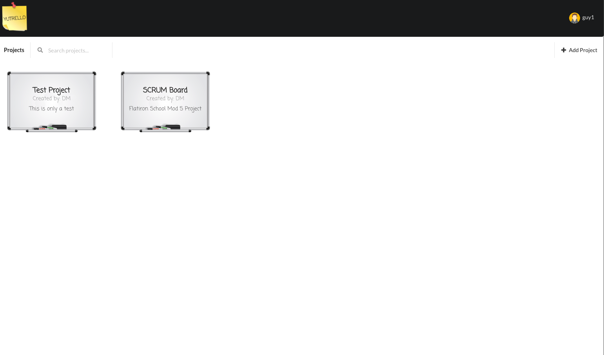
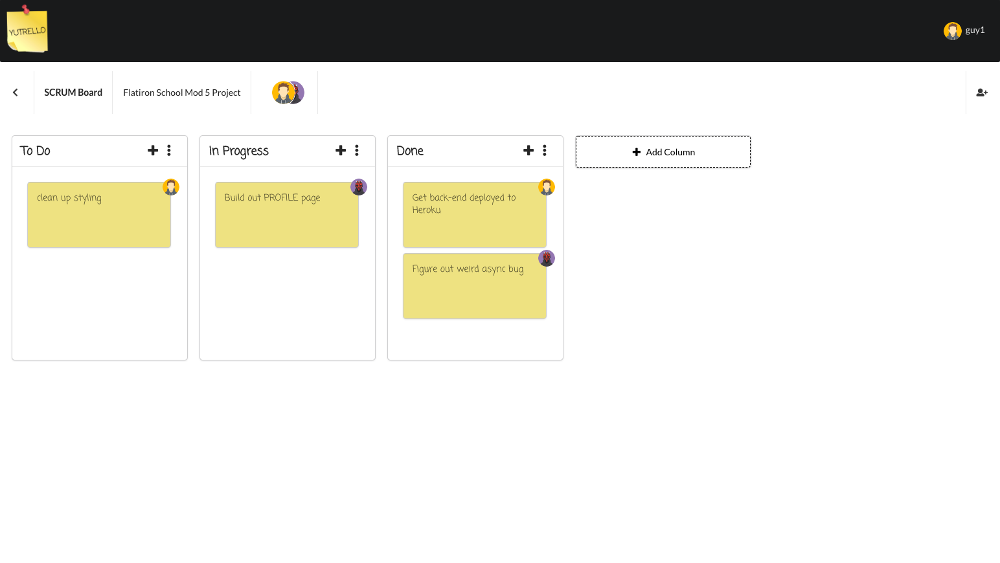

# Yutrello

Yutrello is a web application that helps users keep track of all their projects by letting them create a digital scrum board for each of their projects. The columns and tasks are all customizable with the ability to invite other users to their project and assigning tasks to them. It was built with a Ruby on Rails based backend and a React based frontend. The application uses JWT for authentication and react-beautiful-dnd to add drag-and-drop functionality.

Deployed on Heroku [here] (link TBD) 

## Features
These are the key features and functionality  built into the webiste:
* Users can create an account and login (Uses JWT auth)
* Create/Edit/Delete a project
* Create/Edit/Delete columns on a project
* Create/Edit/Delete tasks in a column
* Add another user to a project
* Assign a user to a task
* Rearrange columns and tasks using drag-and-drop

## Contributing
Contributions are welcome in all shapes and forms, especially bug fixes and feature additions.
To contribute, please fork the repository and create a separate branch that you can then commit and push.
Thank you!

## Next Steps
* Allow users to change color of a task
* Allow users to be notified when a task is assigned to them or added to a project
* Add sorting functionality to projects (Alphabetically/Chronologically/Status)
  * Add status to project (i.e. in Progress, archived, etc.)
* Add ability to add tags to projects
  * Add filtering/searching functionailty based on tags

## Credits
A project by [Yutaro Tsuji](https://github.com/ytsuji27)